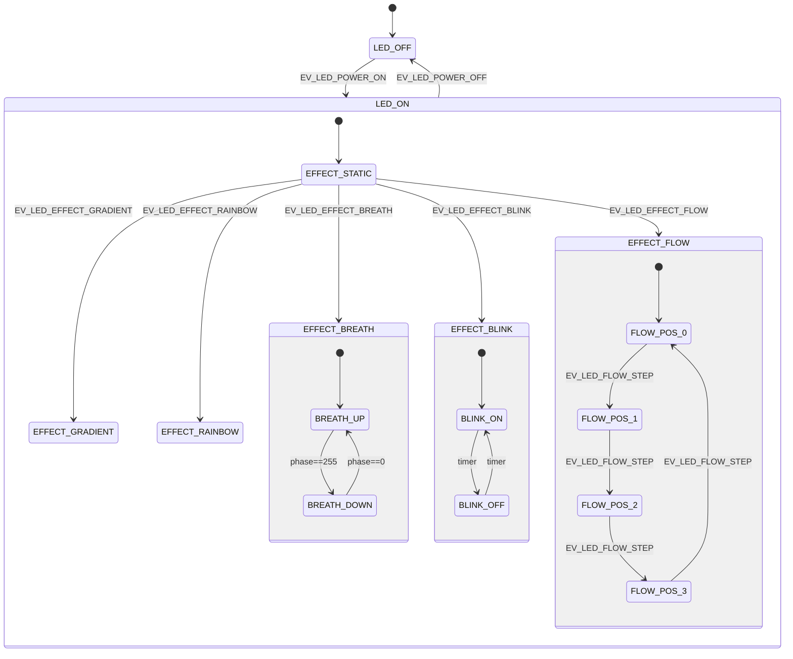

# LED状态机设计分析

## 1. 需求概述
- 控制4颗RGB LED，共12路独立PWM通道。
- 支持多种显示效果：静态、呼吸、闪烁、渐变、流水、彩虹等。
- 支持亮度、颜色、速度等参数调节。
- 支持外部命令接口（如串口、网络）。
- 要求实时性高，代码可维护性强。

## 2. 状态机类型选择
根据`state_machine_types.csv`中的分类，嵌入式控制场景推荐使用**Moore分层状态机**（Moore + Hierarchical）。理由如下：
- **输出与状态相关**：LED的PWM输出取决于当前状态（如呼吸效果需要根据相位计算亮度），适合Moore机（输出在状态中定义）。
- **层次结构**：LED控制具有明显的层次：顶层为电源状态（开/关），第二层为效果选择，第三层为效果子状态（如呼吸的上升/下降、流水的不同位置）。
- **事件驱动**：用户命令、定时器事件等作为输入事件，触发状态转换。
- **单线程**：嵌入式环境通常为单线程，适合Moore分层状态机。

因此，我们采用现有的`moore_hierarchical`框架实现LED FSM。

## 3. 状态层次结构
### 顶层状态（正交区域）
1. **LED_OFF**：LED关闭，所有PWM输出为0。
2. **LED_ON**：LED开启，进入效果选择。

### LED_ON的子状态（效果状态）
- **EFFECT_STATIC**：静态颜色。
- **EFFECT_BREATH**：呼吸效果。
    - **BREATH_UP**：亮度递增。
    - **BREATH_DOWN**：亮度递减。
- **EFFECT_BLINK**：闪烁效果。
    - **BLINK_ON**：亮。
    - **BLINK_OFF**：灭。
- **EFFECT_FLOW**：流水效果。
    - **FLOW_POS_0** ~ **FLOW_POS_3**：分别对应4颗LED的位置。
- **EFFECT_GRADIENT**：渐变效果（暂实现为静态）。
- **EFFECT_RAINBOW**：彩虹效果（颜色循环）。

### 状态图（Mermaid）

## 4. 事件定义
| 事件 | 代码 | 描述 |
|------|------|------|
| EV_LED_POWER_ON | 1 | 打开LED |
| EV_LED_POWER_OFF | 2 | 关闭LED |
| EV_LED_EFFECT_STATIC | 3 | 切换到静态效果 |
| EV_LED_EFFECT_BREATH | 4 | 切换到呼吸效果 |
| EV_LED_EFFECT_BLINK | 5 | 切换到闪烁效果 |
| EV_LED_EFFECT_FLOW | 6 | 切换到流水效果 |
| EV_LED_EFFECT_GRADIENT | 7 | 切换到渐变效果 |
| EV_LED_EFFECT_RAINBOW | 8 | 切换到彩虹效果 |
| EV_LED_BRIGHTNESS_UP | 9 | 亮度增加 |
| EV_LED_BRIGHTNESS_DOWN | 10 | 亮度减少 |
| EV_LED_SPEED_UP | 11 | 速度增加 |
| EV_LED_SPEED_DOWN | 12 | 速度减少 |
| EV_LED_COLOR_CHANGE | 13 | 颜色改变 |
| EV_LED_TIMER_TICK | 14 | PWM更新定时器 |
| EV_LED_FLOW_STEP | 15 | 流水步进 |
| EV_LED_BREATH_STEP | 16 | 呼吸步进 |
| EV_LED_CMD_RECEIVED | 17 | 外部命令到达 |

## 5. 输出动作
- **PWM更新**：每个状态在`led_hsm_update_pwm()`中计算12路PWM值，并通过回调函数输出到硬件。
- **状态入口/出口动作**：例如，进入`LED_OFF`时将所有PWM置零；进入`EFFECT_STATIC`时根据配置的颜色和亮度设置PWM。
- **定时更新**：呼吸、闪烁、流水等效果需要定时更新状态（通过`EV_LED_TIMER_TICK`触发）。

## 6. 实现细节
### 6.1 数据结构
- `led_hsm_t`：扩展自`moore_hsm`，包含配置参数、PWM数组、回调函数等。
- `led_config_t`：存储亮度、速度、颜色、效果类型、流水位置、呼吸相位等。

### 6.2 状态初始化
使用`INIT_STATE`宏定义每个状态，并建立父子关系。层次结构在`init_states()`中构建。

### 6.3 事件处理
每个状态可以实现`handle_event`函数，返回转换代码。转换代码映射到目标状态（`led_state_map`）。

### 6.4 PWM计算
- **静态效果**：所有LED输出相同颜色（应用亮度系数）。
- **呼吸效果**：使用正弦函数计算亮度变化，相位在`BREATH_UP`/`BREATH_DOWN`子状态中递增/递减。
- **流水效果**：每次步进更新`flow_position`，并切换到对应的`FLOW_POS_x`状态，仅点亮当前LED。
- **闪烁效果**：在`BLINK_ON`和`BLINK_OFF`之间切换，PWM相应全开或全关。
- **彩虹效果**：简单实现为颜色循环（红→绿→蓝）。

### 6.5 外部命令接口
`led_hsm_process_command()`解析命令字节，转换为相应的事件或参数设置，支持：
- 电源开关
- 效果选择
- 颜色设置（RGB）
- 亮度设置
- 速度设置

## 7. 测试验证
已编写`test_led_fsm.c`进行完整测试，包括：
1. 电源开关
2. 静态效果（颜色、亮度调节）
3. 呼吸效果（相位递增）
4. 流水效果（位置循环）
5. 外部命令处理
6. 所有效果遍历

测试结果：所有测试通过，PWM输出符合预期。

## 8. 扩展性
- **新增效果**：在`led_effect_t`中添加枚举，创建对应的状态和PWM计算函数。
- **更多LED**：修改`LED_COUNT`和`PWM_CHANNELS`宏。
- **硬件抽象**：PWM回调函数可适配不同硬件平台。
- **配置持久化**：可将`led_config_t`保存到Flash。

## 9. 结论
基于Moore分层状态机的LED控制器设计满足需求，具有清晰的层次结构、可扩展的事件处理和硬件无关的输出抽象。代码已实现并测试通过，可直接集成到嵌入式项目中。
