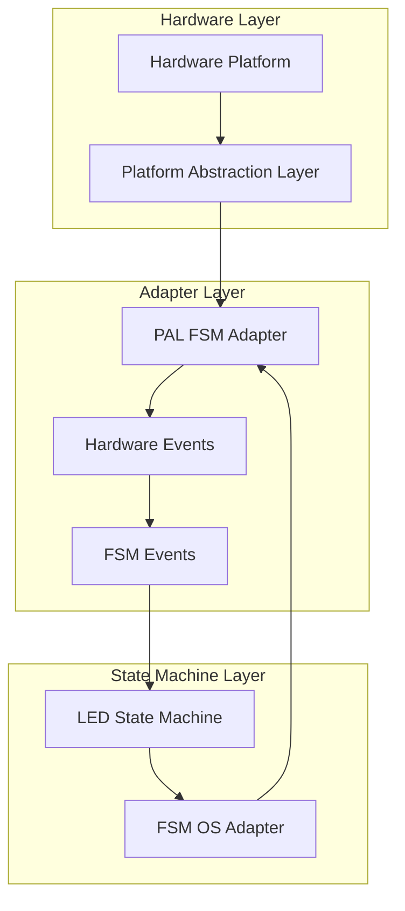

# PAL FSM Integration Example

This example demonstrates the integration of **Platform Abstraction Layer (PAL)** with the **State Machine Extended** framework for embedded hardware control.

## Overview

The Platform Abstraction Layer (PAL) provides a hardware-independent interface for accessing GPIO, timers, communication interfaces, and other hardware peripherals. This example shows how to:

1. Use PAL to abstract hardware differences between platforms
2. Integrate PAL with state machines for event-driven hardware control
3. Create a reusable adapter that bridges hardware events to state machine events
4. Test the integration on different platforms (Windows simulator, Linux, embedded targets)

## Architecture



## Components

### 1. Platform Abstraction Layer (PAL)

The PAL provides:
- **Hardware-independent API** for GPIO, timers, communication interfaces
- **Platform-specific implementations** for Windows, Linux, ARM Cortex-M, ESP32, etc.
- **Unified error handling** and status codes

### 2. PAL FSM Adapter

The adapter bridges PAL hardware events to state machine events:
- **Hardware event detection** (button presses, timer expirations)
- **Event conversion** from hardware events to FSM events
- **Hardware control** (LED control, PWM, etc.)
- **Visualization support** for debugging

### 3. LED State Machine

A sample state machine that:
- Controls an LED based on events
- Supports different modes (ON, OFF, BLINK, PWM)
- Provides hardware control callbacks

## Files

| File | Description |
|------|-------------|
| `pal_fsm_adapter.h` | Header file for PAL FSM adapter |
| `pal_fsm_adapter.c` | Implementation of PAL FSM adapter |
| `pal_led_fsm_example.c` | Example demonstrating PAL-LED FSM integration |
| `pal_fsm_integration_test.c` | Integration test suite |
| `Makefile` | Build configuration |

## Building

### Prerequisites

- GCC compiler
- Platform Abstraction Layer library (`libpal.a`)
- State Machine Extended framework

### Build Commands

```bash
# Navigate to the example directory
cd state_machine_extended/examples/pal_integration

# Build the example
make all

# Build for specific platform
make windows
make linux

# Run the example
make run

# Run tests
make test

# Clean build files
make clean
```

## Usage

### Basic Example

```c
#include "pal_fsm_adapter.h"

int main(void) {
    // Create PAL FSM adapter for Windows simulator
    pal_fsm_adapter_t *adapter = pal_fsm_adapter_create_led_fsm(PAL_PLATFORM_WINDOWS_SIMULATOR);
    
    // Initialize hardware
    pal_fsm_adapter_init_hardware(adapter);
    
    // Main loop
    while (1) {
        // Process hardware events
        pal_fsm_adapter_process_events(adapter);
        
        // Control LED
        pal_fsm_adapter_set_led(adapter, true);
        
        // Read button
        bool pressed = pal_fsm_adapter_get_button(adapter);
    }
    
    // Cleanup
    pal_fsm_adapter_destroy(adapter);
    return 0;
}
```

### Platform Selection

The example supports multiple platforms:

```c
typedef enum {
    PAL_PLATFORM_WINDOWS_SIMULATOR = 0,
    PAL_PLATFORM_LINUX,
    PAL_PLATFORM_ARM_CORTEX_M,
    PAL_PLATFORM_ESP32,
    PAL_PLATFORM_ARDUINO,
    PAL_PLATFORM_RASPBERRY_PI
} pal_platform_t;
```

## Testing

### Integration Tests

The test suite verifies:

1. **Adapter creation and destruction**
2. **LED control functionality**
3. **Button reading capability**
4. **Event processing and conversion**
5. **LED FSM integration**

Run the tests:

```bash
make test
```

### Expected Output

```
=== PAL FSM Integration Test Suite ===
Running 5 test cases...

Test 1: Adapter creation and destruction...
  ✓ Adapter created successfully
  ✓ FSM OS context obtained
  ✓ Hardware initialized
  ✓ Adapter destroyed
Test 1 PASSED

... (additional test output)
```

## Extending for New Hardware

To add support for new hardware platforms:

1. **Implement PAL interface** for the new platform
2. **Update platform detection** in `pal_fsm_adapter.c`
3. **Add platform-specific configuration** (pin mappings, etc.)
4. **Test with the integration test suite**

Example for a new platform:

```c
#ifdef PLATFORM_NEW_HARDWARE
    // Platform-specific initialization
    new_hardware_gpio_init();
    new_hardware_timer_init();
#endif
```

## Benefits

### 1. Hardware Abstraction
- Write hardware-independent state machine code
- Easily port between different embedded platforms
- Simulate hardware behavior on desktop

### 2. Event-Driven Architecture
- Clean separation between hardware events and state transitions
- Asynchronous event processing
- Scalable to complex hardware interactions

### 3. Testability
- Hardware behavior can be simulated for testing
- Unit tests can run without physical hardware
- Integration tests verify hardware-software interaction

### 4. Reusability
- Adapter can be reused across different state machines
- Hardware configurations can be changed at runtime
- Platform-specific code is isolated

## Limitations

1. **Performance overhead** - Additional layer between hardware and state machine
2. **Memory usage** - Adapter structures consume memory
3. **Platform support** - Requires PAL implementation for each target platform

## Future Enhancements

1. **Dynamic platform detection** - Auto-detect hardware at runtime
2. **Hot-swapping** - Change hardware configuration without restart
3. **Performance profiling** - Measure adapter overhead
4. **More hardware interfaces** - Support for I2C, SPI, UART, etc.
5. **Power management** - Integration with low-power modes

## Related Documentation

- [Platform Abstraction Layer Documentation](../../../platform_abstraction_layer/docs/)
- [State Machine Extended Documentation](../../docs/)
- [OS Adapter Guide](../../docs/OS_ADAPTER_GUIDE.md)

## License

Copyright (C) 2000-2025 All Right Reserved

THIS CODE AND INFORMATION ARE PROVIDED "AS IS" WITHOUT WARRANTY OF ANY
KIND, EITHER EXPRESSED OR IMPLIED, INCLUDING BUT NOT LIMITED TO THE
IMPLIED WARRANTIES OF MERCHANTABILITY AND/OR FITNESS FOR A
PARTICULAR PURPOSE.
