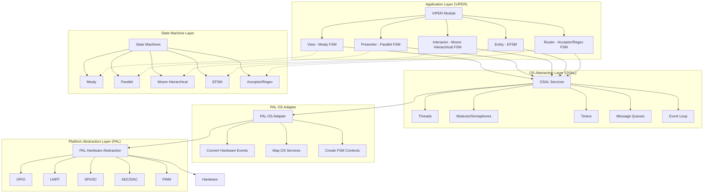

# VIPER, PAL, OSAL, and State Machine Hierarchy

## Overview

This document describes the hierarchical relationship between the VIPER architecture, Platform Abstraction Layer (PAL), OS Abstraction Layer (OSAL), and embedded State Machines.

## Layer Diagram (Mermaid)



## Detailed Layer Description

### 1. Application Layer (VIPER Architecture)

The VIPER module is the top‑layer application architecture, composed of five components each using a specific state machine type:

| Component | FSM Type | Purpose |
|-----------|----------|---------|
| **View** | Mealy Machine | Renders UI, reacts to user input. Output depends on current state and input. |
| **Presenter** | Parallel FSM | Coordinates View, Interactor, and Entity; manages event routing. |
| **Interactor** | Moore Hierarchical FSM | Executes business logic; state transitions depend only on current state. |
| **Entity** | Extended FSM (EFSM) | Manages data model with extended state variables (counters, timers). |
| **Router** | Acceptor/Regex FSM | Matches navigation routes using regular expressions. |

### 2. OS Abstraction Layer (OSAL)

OSAL provides a uniform interface to operating‑system services, abstracting differences between POSIX, FreeRTOS, RT‑Thread, and bare‑metal environments.

**Services:**
- Thread management (create, join, yield)
- Mutexes and semaphores
- Timers (create, start, stop)
- Message queues
- Event loops

VIPER components call OSAL services via the `pal_os_adapter` bridge.

### 3. PAL OS Adapter

A bridge between PAL and OSAL that:
- Converts hardware events (e.g., GPIO interrupt) to OS events.
- Maps OS services to hardware‑specific operations.
- Creates FSM contexts for hardware‑bound state machines.

**Key functions:**
- `pal_os_adapter_init()`
- `pal_os_adapter_convert_event()`
- `pal_os_adapter_create_fsm_context()`

### 4. Platform Abstraction Layer (PAL)

PAL abstracts hardware‑specific details, allowing the same application code to run on different platforms.

**Supported platforms:**
- Windows Simulator (SDL2 GUI)
- STM32 (HAL)
- ESP32 (IDF)
- Linux (generic)

**Hardware services:**
- GPIO (digital I/O)
- UART (serial communication)
- SPI / I2C (bus communication)
- ADC / DAC (analog conversion)
- PWM (pulse‑width modulation)

VIPER interacts with PAL via `pal_*` functions (e.g., `pal_gpio_set()`).

### 5. State Machine Layer (Embedded)

Each VIPER component embeds a specific FSM type, all coordinated through OSAL/PAL for timing and hardware interaction.

| FSM Type | Used by | Characteristics |
|----------|---------|-----------------|
| **Mealy** | View | Output depends on state and input. |
| **Parallel** | Presenter | Multiple concurrent FSMs. |
| **Moore Hierarchical** | Interactor | Hierarchical states; output depends only on state. |
| **EFSM** | Entity | Extended state variables (data). |
| **Acceptor/Regex** | Router | Pattern‑matching transitions. |

## Interaction Flow (Bottom‑Up)

1. **Hardware interrupt** (e.g., button press) detected by PAL.
2. PAL converts the interrupt to a hardware event and passes it to the PAL OS adapter.
3. PAL OS adapter converts the hardware event to an OS event and queues it in OSAL.
4. OSAL delivers the event to the application (VIPER View).
5. View processes the event via its Mealy FSM and triggers the Presenter.
6. Presenter (Parallel FSM) coordinates the Interactor and Entity.
7. Interactor (Moore FSM) executes business logic.
8. Entity (EFSM) updates the data model and may call OSAL services (e.g., start a timer).
9. OSAL uses the PAL OS adapter to perform hardware operations.
10. PAL drives the actual hardware (LED, display, etc.).

## Example Scenario: Todo App “Add Item”

| Step | Component | Action |
|------|-----------|--------|
| 1 | **View** | User clicks “Add” button → Mealy FSM transitions to LOADING state. |
| 2 | **Presenter** | Parallel FSM routes the event to the Interactor. |
| 3 | **Interactor** | Moore FSM validates input and executes the business rule. |
| 4 | **Entity** | EFSM transitions to MODIFIED state and saves data. |
| 5 | **OSAL** | Starts an auto‑save timer via `pal_os_adapter`. |
| 6 | **PAL** | Blinks an LED to confirm the operation. |

## Conclusion

The VIPER architecture is layered atop OSAL and PAL, with each component using a specialized state machine. This separation ensures platform independence, testability, and clear separation of concerns. The hierarchy can be summarized as:

```
Application (VIPER)
    ↓
OS Abstraction Layer (OSAL)
    ↓
PAL OS Adapter
    ↓
Platform Abstraction Layer (PAL)
    ↓
Hardware
```

All layers are coupled through well‑defined interfaces, enabling the same application logic to run on simulators, embedded systems, and desktop environments.
