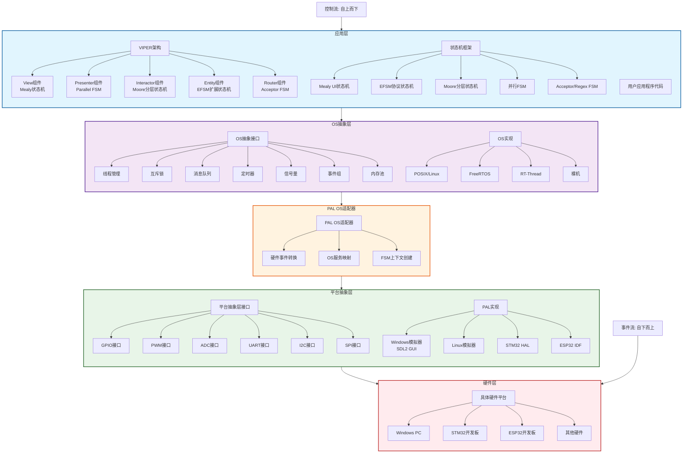

# VIPER、PAL、OSAL与状态机层级关系架构文档

## 概述

本文档详细描述了Design-Patterns-in-C项目中VIPER架构、平台抽象层(PAL)、操作系统抽象层(OSAL)和状态机框架之间的层级关系。这种分层架构设计实现了硬件无关性、操作系统可移植性和清晰的架构分离。

## 架构层级图



## 各层详细说明

### 1. 应用层 (Application Layer)

#### 1.1 VIPER架构组件
VIPER是一种清晰的架构模式，将应用程序分为五个独立组件：

| 组件 | 对应状态机类型 | 职责 |
|------|---------------|------|
| **View** | Mealy事件驱动状态机 | 处理用户界面事件和更新 |
| **Presenter** | 并行FSM | 协调多个组件，管理数据流 |
| **Interactor** | Moore分层状态机 | 实现业务逻辑，具有分层状态 |
| **Entity** | EFSM扩展状态机 | 管理数据模型，支持扩展变量 |
| **Router** | Acceptor FSM | 处理导航和路由模式 |

#### 1.2 状态机框架
提供五种扩展状态机实现，是VIPER架构的技术基础：

- **Mealy UI状态机**：事件驱动，输出取决于当前状态和输入
- **EFSM协议状态机**：扩展有限状态机，支持变量和复杂条件
- **Moore分层状态机**：分层状态管理，输出仅取决于状态
- **并行FSM**：多个状态机并行运行，支持并发处理
- **Acceptor/Regex FSM**：模式匹配，用于路由和协议解析

### 2. OS抽象层 (OS Abstraction Layer)

#### 2.1 核心服务
提供跨操作系统的统一接口：

- **线程管理**：创建、销毁、调度线程
- **同步原语**：互斥锁、信号量、事件组
- **通信机制**：消息队列、邮箱
- **时间管理**：定时器、延时
- **内存管理**：内存池分配

#### 2.2 支持的OS环境
- **POSIX/Linux**：标准Linux/Unix系统
- **FreeRTOS**：嵌入式实时操作系统
- **RT-Thread**：国产嵌入式RTOS
- **裸机**：无操作系统环境

### 3. PAL OS适配器层 (PAL OS Adapter)

#### 3.1 核心功能
作为OSAL和PAL之间的桥梁：

- **硬件事件转换**：将GPIO中断、定时器事件等转换为OS事件
- **OS服务映射**：将OS抽象服务映射到具体硬件平台
- **FSM上下文创建**：为状态机创建平台相关的执行上下文

#### 3.2 设计优势
- **解耦硬件和OS**：使状态机不直接依赖具体硬件
- **事件统一处理**：统一硬件事件和软件事件的处理流程
- **平台配置灵活**：通过配置选择不同的硬件平台

### 4. 平台抽象层 (Platform Abstraction Layer)

#### 4.1 硬件接口抽象
统一的硬件访问接口：

- **数字IO**：GPIO输入/输出、中断
- **模拟接口**：ADC、DAC
- **通信接口**：UART、I2C、SPI、CAN
- **定时器**：PWM、定时器中断
- **高级功能**：DMA、加密引擎等

#### 4.2 支持的平台实现
- **Windows模拟器**：SDL2 GUI，可视化调试环境
- **Linux模拟器**：终端或X11界面，硬件模拟
- **STM32 HAL**：基于STM32硬件抽象层
- **ESP32 IDF**：基于ESP-IDF框架

### 5. 硬件层 (Hardware Layer)

#### 5.1 具体硬件平台
- **Windows PC**：开发调试环境
- **STM32开发板**：ARM Cortex-M系列微控制器
- **ESP32开发板**：Xtensa双核WiFi/BLE SoC
- **其他硬件**：Raspberry Pi、NRF52等

## 数据流与交互

### 控制流 (自上而下)
```
用户操作 → VIPER View → 状态机事件 → OS服务调用 → 
PAL OS适配器 → PAL硬件接口 → 具体硬件控制
```

### 事件流 (自下而上)
```
硬件中断 → PAL事件检测 → PAL OS适配器转换 → 
OS事件队列 → 状态机事件处理 → VIPER组件更新
```

## 设计原则与优势

### 1. 分层抽象原则
- **单一职责**：每层只负责特定功能
- **依赖倒置**：上层不直接依赖下层具体实现
- **接口隔离**：通过清晰接口进行层间通信

### 2. 平台无关性
- **硬件无关**：应用代码不直接操作硬件寄存器
- **OS无关**：状态机框架可在不同OS上运行
- **开发环境无关**：可在模拟器和真实硬件间无缝切换

### 3. 可测试性
- **模拟器支持**：无需硬件即可进行完整功能测试
- **单元测试友好**：各层可独立测试
- **可视化调试**：GUI界面显示硬件状态和事件流

### 4. 可维护性
- **清晰边界**：各层边界明确，易于理解和维护
- **模块化设计**：可单独替换或升级某一层
- **文档完善**：每层有明确的接口文档和示例

## 实际应用示例

### 示例：LED控制应用

```c
// 1. 应用层：VIPER View组件（Mealy状态机）
void view_handle_button_press(void) {
    mealy_machine_handle_event(led_fsm, EVENT_BUTTON_PRESS);
}

// 2. 状态机层：处理事件并决定LED状态
State led_state_machine(Event event) {
    // 状态转换逻辑
    return NEXT_STATE;
}

// 3. OS抽象层：定时器控制
os_timer_start(blink_timer, 500); // 500ms闪烁

// 4. PAL OS适配器：转换OS定时器事件为硬件控制
void pal_os_timer_callback(void) {
    pal_gpio_toggle(PIN_LED);
}

// 5. PAL层：实际硬件控制
void pal_gpio_toggle(pal_gpio_pin_t pin) {
    // 平台特定实现
    #ifdef PLATFORM_STM32
        HAL_GPIO_TogglePin(GPIOA, GPIO_PIN_5);
    #elif PLATFORM_WINDOWS_SIM
        sdl_gui_toggle_led(pin);
    #endif
}
```

## 扩展与定制

### 1. 添加新硬件平台
1. 实现PAL接口的所有函数
2. 添加平台配置选项
3. 更新构建系统
4. 编写平台测试用例

### 2. 添加新OS支持
1. 实现OS抽象层接口
2. 提供OS特定实现
3. 更新OS适配器配置
4. 验证线程和同步原语

### 3. 扩展状态机类型
1. 定义新的状态机接口
2. 实现状态机逻辑
3. 集成到VIPER映射中
4. 提供示例和文档

## 结论

VIPER、PAL、OSAL和状态机框架之间的层级关系体现了现代嵌入式系统设计的优秀实践：

1. **架构清晰**：VIPER提供应用层架构，状态机提供技术基础
2. **抽象合理**：OSAL和PAL分别抽象操作系统和硬件平台
3. **桥梁有效**：PAL OS适配器连接软件框架和硬件平台
4. **可移植性强**：支持多种硬件和OS环境
5. **开发效率高**：模拟器支持加速开发调试

这种分层架构使得嵌入式系统开发能够：
- 在PC上进行早期开发和测试
- 轻松移植到不同硬件平台
- 保持代码质量和可维护性
- 支持团队并行开发

---

*文档生成时间：2025年12月22日*  
*基于项目分析：Design-Patterns-in-C*  
*相关文件：viper_architecture/, platform_abstraction_layer/, state_machine_extended/, os_abstraction_layer/*
